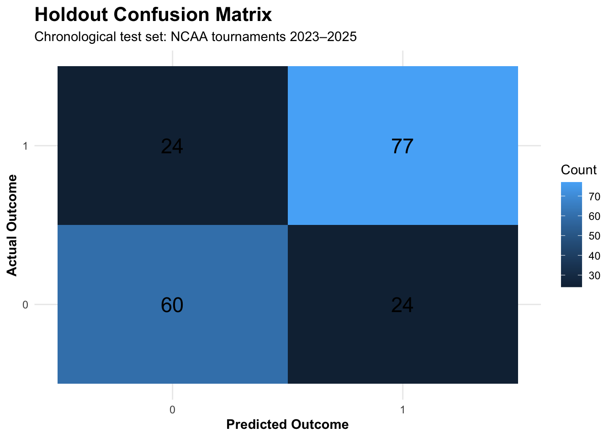
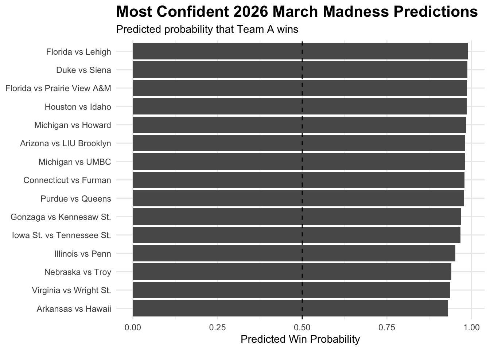

# March Madness Betting Analytics

An end-to-end NCAA March Madness analytics project combining **matchup feature engineering, LASSO feature selection, multivariate analysis, logistic regression, and Kelly Criterion bet sizing** to estimate tournament win probabilities and support risk-aware betting decisions.

## Project Overview

This project uses historical **KenPom/BartTorvik team statistics** and NCAA tournament matchup data to answer two questions:

1. Can historical team statistics estimate the probability that one team defeats another?
2. When valid sportsbook odds are available, how can those probabilities be translated into disciplined bankroll allocations?

## Key Results

To better approximate prospective prediction and reduce temporal leakage, the data were split chronologically:

- **Training:** 2008–2022 NCAA tournaments
- **Holdout testing:** 2023–2025 NCAA tournaments
- **Future predictions:** supplied 2026 matchup rows

The logistic regression model achieved:

| Metric | Holdout Performance |
| --- | ---: |
| Accuracy | **74.05%** |
| Sensitivity | **76.24%** |
| Specificity | **71.43%** |

### Holdout Confusion Matrix

| Actual / Predicted | Loss | Win |
| --- | ---: | ---: |
| Loss | 60 | 24 |
| Win | 24 | 77 |



The chronological holdout asks a more realistic question than a random split: **can a model developed from earlier tournaments generalize to tournaments that occur later?**

## Modeling Workflow

```text
Historical Tournament Matchups
            ↓
KenPom + BartTorvik Statistics
            ↓
Game-Level Matchup Construction
            ↓
Team A − Team B Feature Engineering
            ↓
Leakage & Identifier Removal
            ↓
Chronological Train/Test Split
            ↓
Correlation Analysis
            ↓
LASSO Feature Selection
            ↓
Multivariate Analysis (MANOVA)
            ↓
Logistic Regression
            ↓
2023–2025 Holdout Evaluation
            ↓
2026 Matchup Win Probabilities
            ↓
Fractional Kelly Bet Sizing
```

## Methodology

### Matchup Feature Engineering

Tournament data are transformed from team-level rows into game-level observations. Numeric KenPom/BartTorvik statistics are converted into matchup differences:

```text
Difference = Team A Statistic − Team B Statistic
```

Historical Team A/Team B ordering is randomized for approximately half of the games to reduce the possibility that the model learns systematic row ordering rather than basketball strength.

Potential leakage and identifier variables are removed before modeling.

### LASSO Feature Selection

Because the dataset contains many correlated basketball metrics, **LASSO logistic regression with 10-fold cross-validation** is applied only to the training seasons to select a smaller predictive feature set.

Keeping feature selection inside the training period prevents the 2023–2025 holdout seasons from influencing predictor selection.

### Multivariate Analysis

The LASSO-selected variables are evaluated jointly using **MANOVA**. The workflow checks for linear dependence among the response variables before fitting the multivariate model.

Multivariate normality is treated as a diagnostic rather than proof that all MANOVA assumptions are perfectly satisfied.

### Logistic Regression

An interpretable logistic regression model is fit using the LASSO-selected predictors. The model estimates the probability that Team A wins each matchup, with a 0.50 threshold used for holdout classification.

## 2026 Predictions

The trained model is applied to the supplied 2026 matchup rows to generate Team A and Team B win probabilities and a predicted winner.

The 2026 source file contains placeholder matchups across multiple tournament stages, so these results represent probabilities for the **supplied pairings**, not a fully simulated tournament bracket.



## Kelly Criterion

The project extends probability estimation into decision-making using the **Kelly Criterion**.

For decimal odds `d`:

```text
b = d - 1
f* = (bp - (1 - p)) / b
```

where `p` is the model-estimated win probability, `b` is the net profit per dollar wagered, and `f*` is the recommended bankroll fraction.

Negative Kelly values are treated as no-bet decisions. A fractional Kelly implementation is also included to demonstrate how wager sizes can be reduced to manage bankroll volatility.

> **Important:** A verified historical sportsbook-odds dataset is not included in the current project. The Kelly component is therefore a reproducible bet-sizing framework and simulation tool—not evidence of validated real-world betting returns.

## Tools & Techniques

**Language:** R

**Libraries:** `dplyr`, `stringr`, `glmnet`, `corrplot`, `MVN`, `ggplot2`

**Methods:** Feature engineering, correlation analysis, LASSO regularization, cross-validation, multivariate normality diagnostics, MANOVA, logistic regression, chronological holdout validation, confusion-matrix evaluation, Kelly Criterion

## Repository Structure

```text
march-madness-betting-analytics/
├── README.md
├── analysis/
│   └── march_madness_analysis.Rmd
├── data/
│   ├── README.md
│   ├── KenPom_Barttorvik.csv
│   └── Tournament_Matchups.csv
├── figures/
│   ├── holdout_confusion_matrix.png
│   └── 2026_predictions.png
├── report/
│   └── Optimal_Bet_Sizing_March_Madness_Project_Report.pdf
├── .gitignore
└── LICENSE
```

## Reproducing the Analysis

1. Clone or download the repository.
2. Open `analysis/march_madness_analysis.Rmd` in RStudio.
3. Install the required R packages if necessary.
4. Ensure the two source CSV files are available under `data/`.
5. Knit the R Markdown analysis or run the analysis sections sequentially.

The analysis uses relative paths so it can be reproduced without machine-specific file locations.

## Limitations

The model relies on historical team-level metrics and does not explicitly incorporate injuries, player availability, lineup changes, or other game-specific information.

Source statistics should ideally represent only information available before each predicted game. If a source metric incorporates games occurring after a prediction date, that would introduce look-ahead bias and should be addressed in a future iteration.

The supplied 2026 data contain placeholder matchups across multiple stages, so later-round predictions do not constitute a complete bracket simulation.

Without verified historical sportsbook prices, this repository does **not** claim that the model would have produced profitable real-world wagers.

## Future Improvements

Potential extensions include verified historical sportsbook odds, bookmaker-vig adjustments, probability calibration, player availability and injury information, tournament bracket simulation, and backtesting fractional-Kelly strategies under realistic bankroll constraints.

## Key Takeaway

This project demonstrates an end-to-end statistical modeling workflow that moves from raw team statistics to **out-of-sample probability estimates and decision-making under uncertainty**.

The final model achieved **74.1% accuracy on NCAA tournament games from 2023–2025 that were excluded from model training**, while the Kelly Criterion component illustrates how predictive probabilities can be converted into risk-aware decisions when valid market odds are available.

## Disclaimer

This project is intended for educational and analytical purposes only. Betting examples and Kelly Criterion calculations do not constitute gambling or financial advice.
